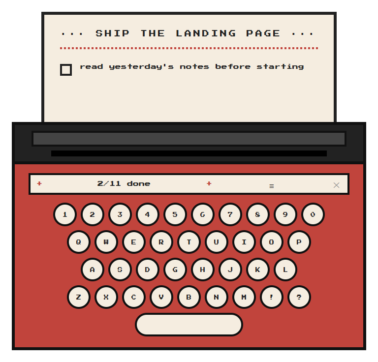
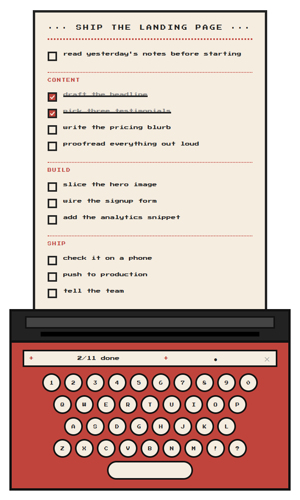

# Typewriter

A tiny, always-on-top pixel-art typewriter for Windows 11 that prints your Markdown
checklist onto a sheet of paper and tracks it as you work.

<p align="center">
  <a href="https://github.com/nikhil-chigali/typewriter/releases/latest">
    
  </a>
</p>

<p align="center">
  
  &nbsp;&nbsp;
  
</p>

Focus mode shows a single task at a time. Finish it and the next one prints into place.

```bash
npm install
npm start
```

To build a Windows installer and a portable `.exe` into `dist/`:

```bash
npm run dist
```

## First run

Typewriter asks you once where to keep its records and remembers the answer.
If you dismiss the picker it falls back to `Documents\Typewriter`.

- **Records** (plans, progress, notes, abort logs) live in the folder you pick.
- **Config** lives in the OS-standard user config directory,
  `%APPDATA%\Typewriter\config.json`.

No path is ever hardcoded.

## Size

The artwork is drawn at 420×720 (focused) and 420×950 (list mode). On a high-resolution
monitor without OS scaling, a 7px font really is seven pixels, so on first run Typewriter
picks a size that suits your display — roughly double apparent size, backed off if Windows
is already scaling or the screen is short. Adjust it any time:

| | |
|---|---|
| `Ctrl` `+` | bigger |
| `Ctrl` `-` | smaller |
| `Ctrl` `0` | back to automatic |

Steps run 1×–3×, and the choice is remembered. The window never grows past the work area;
if a scaled list would overflow, the sheet caps itself and scrolls rather than clipping.

## Loading a plan

Drop a `.md` file onto the typewriter, or copy a plan and press `Ctrl+V`.
There is a ready-made [sample-plan.md](sample-plan.md) in the repo to try.

```markdown
# Plan title

## Section
- [ ] Task
- [x] Completed task
```

The first `#` heading is the title and is required, `##` headings create sections,
and at least one task is required. Tasks may appear before any section. Everything
else in the file is ignored. A bad plan gets you `couldn't read this plan :(` and a
shake.

Dropped files are **copied** into your records folder — the original is never
modified or deleted. If the name is taken, a timestamp is appended. Pasted plans are
saved under a slug of their title.

## Several plans at once

Typewriter holds as many plans as you like. Press `▤` to see them all: live
plans first, most recently worked on at the top, with finished and abandoned
ones below a dotted rule. Click one to put it on the roller.

Switching loses nothing. Each plan keeps its own progress file, so you can move
between streams all day and come back to exactly where you left off.

Dropping or pasting a new plan while one is loaded imports it and switches
straight to it.

## Records

Each plan gets a sidecar next to it:

```
my-plan.md
my-plan.progress.json
```

The sidecar holds the done-state and completion timestamp of every task by flattened
index, and is the authority when a plan is reopened. The Markdown is kept in sync —
checking a task rewrites `- [ ]` to `- [x]` and appends `(done YYYY-MM-DD HH:MM)`.

## Controls

| | |
|---|---|
| Drag the typewriter body | move the window |
| Click a task or its box | check / uncheck |
| `≡` / `●` | full list ↔ focus mode |
| `▤` | your plans — switch between them |
| `♪` / `✕` | sound on / muted |
| `Ctrl+C` | abort the active plan |
| `Ctrl` `+` / `-` / `0` | resize (see above) |

Focus mode shows only the first unfinished task and its section. Finish one and the
next prints into place. Finish them all and you get confetti, a completion stamp, and
a prompt to leave a session note — appended to the stored plan.

`Ctrl+C` offers three ways out: **log it** (keeps the plan and sidecar and records the
abort), **discard** (deletes the stored plan and its sidecar — never anything outside
your records folder), or **cancel**.

## Layout

```
src/main/main.js       window, IPC, lifecycle
src/main/records.js    config, records folder, plan + sidecar storage
src/main/markdown.js   plan parsing and in-place task rewriting
src/preload/preload.js the IPC bridge (context-isolated)
src/renderer/          app.js, audio.js, fx.js, styles.css, index.html
```

No runtime dependencies — Electron and electron-builder are the only devDependencies,
and the font is bundled, so nothing is fetched at runtime.

## Credits

The idea for this app comes from [Tina Huang](https://www.youtube.com/@TinaHuang1) — a
pixel-art typewriter that prints your Markdown checklist and tracks it as you work. This
is an independent implementation built from that concept, and is not affiliated with,
endorsed by, or connected to her in any way.

## Licence

MIT — see [LICENSE](LICENSE).

The bundled font, [Press Start 2P](https://fonts.google.com/specimen/Press+Start+2P), is
used under the SIL Open Font License 1.1 — see
[THIRD-PARTY-NOTICES.md](THIRD-PARTY-NOTICES.md).
